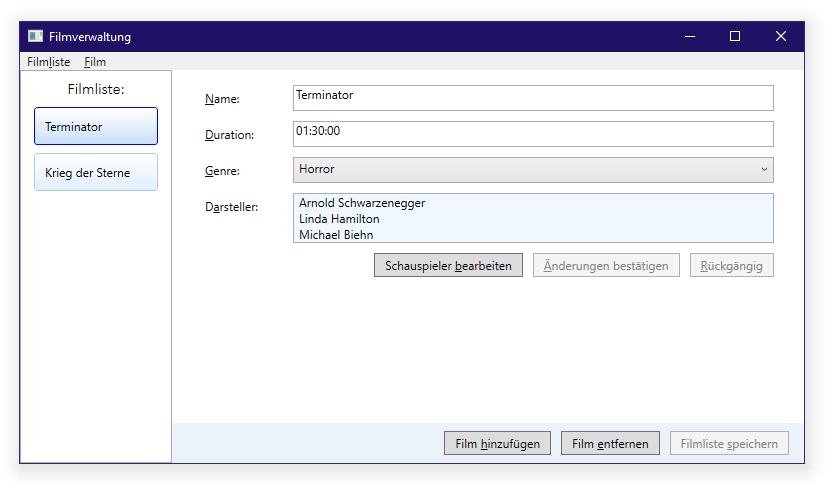

# WPF MVVM Demo Solution

I created this .NET 5 solution to catch a glimpse at WPFs design of MVVM.

This solution is a basic movie list management front-end. I stepped through all common areas of MVVM to create
a front-end providing for adding, editing and removing films from a list. Same for a movie's actors.

Editing is implemented by including a memory efficient transaction feature:
Films and actors may be edited at random. Any changes remain being temporary. At any time, changes
may either be manually committed, saved or undone.

## How To

When the program is started, the main window opens:


On the left side there is a list of all films stored in the repository while on the right you can inspect and edit the seleced film's details.

Right below the film detail form there are all commands related to the film while at the bottom of the window all commands related to the list are found.

<br/>

Actors are maintained in a separate Window:


Same rules apply here: All commands related to an actor are found below the input form while alle commands related to the whole list of actors of a film are found at the bottom of the window.


## Editing

All data may be edited inline. While editing, every record shifts to one of the following four states:

|||
|-|-|
| | Untouched record, identical to repository version. |
|  | New record, yet uncomitted. |
|  | Edited record, yet uncomitted. |
|  | Committed record, yet unsaved to repository. |

<br/>

Films are adorned by the corresponding edit status icon in the film list on the left:


<br/>

Actors are adorned by the corresponding edit status icon next to the actor's or acress' name:


## Implementer's Notes

All the business logic resides in the view-model code, as suggested by Microsoft's WPF MVVM pattern. There's almost no C# code present in the front-end project.

Since this is a front-end test project, I refrained from implementing or utilizing any data storage. This piece
of demo loads its data from a static in-memory array on application start and discards it when the program
window closes.

In this solution I kept comments and program labels in German because I planned it to only be a personal demonstration project and I wanted to see how the design adapts to large button texts.

This Visual Studio 2019 solution includes a wealth of unit tests, performed on the view-model part of the solution.

## Known Issues

I published this repository on GitHub because I am facing a few issues with this project which I asked Microsoft experts to have a look at.

**These issues are:**

1. Although I created this solution with the latest .NET 5 SDKs from the project templates coming with Visual Studio 2019, [`init` only auto property setters](https://docs.microsoft.com/dotnet/csharp/whats-new/csharp-9#init-only-setters) are not recognized by Roslyn compiler without me being required to manually add a `System.Runtime.CompilerServices.IsExternalInit` class.

   → https://github.com/dotnet/roslyn/issues/50696

<br/>

1. The `.editorconfig` file created by Visual Studio 2019 comes with rules diverging from Visual Studio 2019 behaviour evinced without such `.editorconfig` file.

   → https://github.com/dotnet/roslyn/issues/50738

   In particular, the `csharp_preferred_modifier_order` rule lacks the `internal` access modifier in the `.editorconfig` file.

<br/>

1. The `CommandParameter` attribute is not read by `MenuItem`.

   Though all [`MenuItem`](https://docs.microsoft.com/dotnet/api/system.windows.controls.menuitem)s' commands in the program match the [`Button`](https://docs.microsoft.com/dotnet/api/system.windows.controls.button)s' commands 1:1, while `CommandParameter`s are processed correctly by the `Button` elements, the corresponding argument is always `null` when triggered by a `MenuItem`.

   ```xml
   <MenuItem Header="Film_liste" ItemsSource="{Binding Path=Commands}">
       <MenuItem.ItemTemplate>
         <DataTemplate>
           <MenuItem Command="{Binding}" CommandParameter="{Binding ElementName=Filmliste, Path=SelectedItem}" Header="{Binding Path=Text}" />
         </DataTemplate>
       </MenuItem.ItemTemplate>
     </MenuItem>

     ...

     <ItemsControl.ItemTemplate>
       <DataTemplate>
         <Button Command="{Binding}" CommandParameter="{Binding ElementName=Filmliste, Path=SelectedItem}" Content="{Binding Path=Text}" Margin="5" Padding="10 3"></Button>
       </DataTemplate>
     </ItemsControl.ItemTemplate>
   ```

   → https://github.com/dotnet/wpf/issues/4078